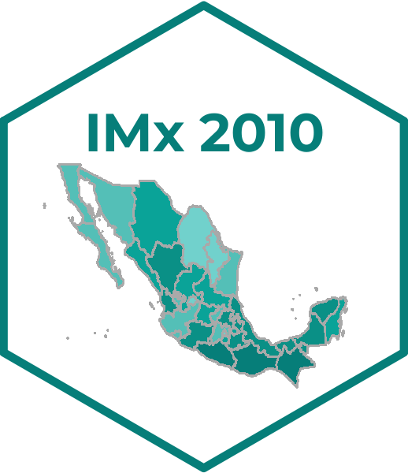

<!-- README.md is generated from README.Rmd. Please edit that file -->

```{r, echo = FALSE}
knitr::opts_chunk$set(echo = FALSE, message = FALSE, warning = FALSE, collapse = TRUE, cache = FALSE,
  comment = "# ",
  fig.path = "Tools/README-",
  dpi = 67)
#options(knitr.table.format = 'html')
#options(allow_html_dependencies=TRUE)
#options(allow_html_in_all_outputs=TRUE)
```


<style type="text/css">
body {
text-align: justify;
font-style: normal;
font-family: "Montserrat";
font-size: 16px
}
h1 {
  color: #B6854D;
  font-size: 30px
}
h2 {
  color: #B6854D;
  font-size: 28px
}
h3 {
  color: #B6854D;
  font-size: 25px
}
</style>

## Indice de marginación 2010 

<!-- badges: start -->
[](https://github.com/r-lib/usethis/actions/workflows/R-CMD-check.yaml)
<!-- badges: end -->


Las estimaciones que aquí se presentan se elaboraron, por primera ocasión, con la técnica denominada Distancias Ponderadas al cuadrado. 


<!-- Anotaciones: start -->
### Conjunto de datos
<!-- Anotaciones: end --> 

- [Índice de marginación por entidad federativa, 2010](https://github.com/IndiceMx/IM_2010/blob/92ed86d1e1706e13d874d5655ac75a35f53de460/IME_2010.xlsx)  
- [Índice de marginación por municipio, 2010](https://github.com/IndiceMx/IM_2010/blob/091cf8b2d124cc6f399b1bc9f6041e15c67fb6ef/IMM_2010.xlsx)  
- [Índice de marginación por localidad, 2010](https://github.com/IndiceMx/IM_2010/blob/091cf8b2d124cc6f399b1bc9f6041e15c67fb6ef/IML_2010.xlsx) 
- [Índice de marginación urbana por AGEB, 2010](https://github.com/IndiceMx/IM_2010/blob/091cf8b2d124cc6f399b1bc9f6041e15c67fb6ef/IMU_2010.xlsx) 

### :link: [Datos abiertos](https://datos.gob.mx/) 


<video width="620" height="540" autoplay muted>
   <source src="C:/Users/dvill/Desktop/IMx/IM_2010/Tools/Datos Abiertos.mp4" type="video/mp4">
</video>


### Metadatos

```{r, echo=FALSE}
tabla <- data.frame(Campo = c("Fuente", 
                              "Email del publicador", 
                              "Frecuencia", 
                              "GUID", 
                              "Idioma", 
                              "Modificado", 
                              "Nombre del publicador", 
                              "Publicado", 
                              "Tema", 
                              "Tipo del publicador", 
                              "Diccionario de Datos"),
                    Valor = c("www.gob.mx/conapo", 
                              "raul.romo@conapo.gob.mx",  
                              "R/P5Y", 
                              "Índice de marginación (carencias poblacionales) por localidad, municipio y entidad", 
                              "es", 
                              "2021-09-29T00:00:00Z", 
                              "CONAPO", 
                              "2017-06-06T22:31:26Z", 
                              "Desarrollo", 
                              "Director de Poblamiento y Desarrollo Regional Sustentable",
                              "Consulta")) 


require(knitr)
require(kableExtra)
kable(tabla, format = "html", size = 10, escape = FALSE) %>%
   kable_styling(position = "center",
                 font_size = 10,
                  bootstrap_options = c("condensed", "hover")) %>%
   kable_classic(full_width = F, html_font = "montserrat") %>%
    row_spec(0, color = "black", bold = TRUE) %>% 
     column_spec(1, color = "black", bold = TRUE) %>% 
      collapse_rows(columns = 1, valign = "middle") %>%
       column_spec(2, underline = TRUE, link = c("https://www.gob.mx/conapo", "", "", "", "", "","", "", "", "", "https://www.gob.mx/conapo/documentos/diccionarios-de-las-bases-de-datos-de-marginacion?idiom=es"))
```
